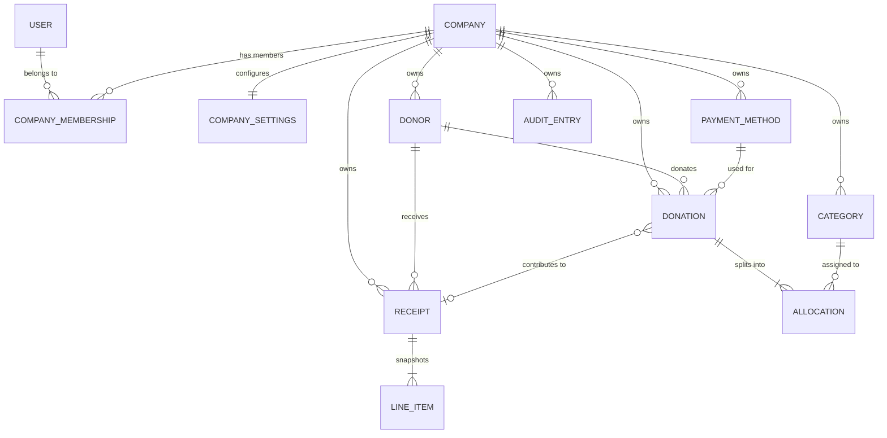

# ADR 0002 — Data Model

**Date:** 2026-04-23
**Status:** Accepted (revised 2026-04-23 for multi-company support)
**Context:** Phase 2 of KRK Donations MVP. Locks the Firestore schema before any CRUD is written.

---

## Multi-company architecture

One user account can be linked to one or more companies. Each company is a completely isolated data environment: its own donors, donations, categories, payment methods, receipts, audit log, and receipt sequence.

Two tiers of collections:

- **Global (top-level):** `users/{uid}`, `companies/{companyId}`.
- **Company-scoped (subcollections of `companies/{companyId}`):** everything sensitive — `donors`, `categories`, `paymentMethods`, `donations`, `receipts`, `auditLog`, `counters`, `settings`.

A client request to `companies/{companyId}/…` is allowed only when the caller's `users/{uid}.companyIds` array contains that `companyId`. This enforces isolation at the Firestore rule layer, not in application code.

The `users/{uid}.companyIds` array is the authoritative membership list. Clients can never modify it directly — it is mutated only by the `createCompany` Cloud Function via the Admin SDK. This prevents a user from granting themselves access to any other company.

---

## Entity diagram

`COMPANY_MEMBERSHIP` above is modelled as the `users.companyIds` array, not its own collection.

Cardinality notes:
- A **user** can belong to 1..N **companies**.
- A **company** in MVP has exactly one **owner** (the user whose `uid` matches `company.ownerUid`). Additional members are post-MVP.
- A **donation** has 1..N **allocations**. All subcollections stay inside the same company path as their parent.
- A merged **donor** has its donations reassigned to the primary; secondary donors stay with `status='archived'` and `mergedIntoId` pointing to the primary. Both must be in the same company.
- All cross-entity references (`donorId`, `paymentMethodId`, `categoryId`, `receiptId`) are implicit within the same company's subtree. We never link across companies.

---

## Global collections

### `users/{uid}`
One doc per authenticated user. `uid` matches the Firebase Auth UID.

| Field | Type | Notes |
|---|---|---|
| `email` | string | Mirrors the Firebase Auth email. |
| `displayName` | string? | Optional. |
| `role` | string | `"admin"` (only role in MVP). |
| `companyIds` | string[] | Companies this user can access. **Never written by clients** — only the `createCompany` Cloud Function (Admin SDK) mutates this. |
| `activeCompanyId` | string \| null | The company currently selected in the UI. Persists across sessions. Clients may self-update, but only to a value that is already in their own `companyIds`. |
| `createdAt` | timestamp | Server-set on first sign-in via `ensureUserDoc`. |

### `companies/{companyId}`
Registry of companies. Lightweight — just the name and owner. Per-company configuration lives under `companies/{companyId}/settings/main`.

| Field | Type | Notes |
|---|---|---|
| `name` | string | Display name used in the company switcher. |
| `ownerUid` | string | The user who created this company. MVP: also the only member. |
| `createdAt` | timestamp | Server-set. |

Clients cannot create, update, or delete company docs directly. All company lifecycle flows go through Cloud Functions (`createCompany`, and in post-MVP, `renameCompany`, `deleteCompany`). Clients can only *read* a company doc if their `companyIds` includes it.

---

## Company-scoped collections

Every collection below is a subcollection of a specific company. Its full path is `companies/{companyId}/<collection>/…`. Access to any doc under this prefix requires the caller's `companyIds` to include that `companyId`.

### `companies/{companyId}/settings/main`
Single-document collection. Fields:

| Field | Type | Notes |
|---|---|---|
| `legalName` | string | Required. Used on receipts. |
| `charityNumber` | string | Required. Format `^\d{9}RR\d{4}$` (e.g. `123456789RR0001`). |
| `address` | map | `{ line1, line2?, city, province, postalCode, country }`. |
| `signatory` | map | `{ name, title }`. |
| `logoUrl` | string? | Firebase Storage URL. Set in Phase 7. |
| `signatureUrl` | string? | Firebase Storage URL. Set in Phase 7. |
| `receiptTemplate` | map | `{ headerText, bodyText, footerText }` — all optional; hard-coded defaults if missing. |
| `updatedAt` | timestamp | Server-set. |

### `companies/{companyId}/donors/{donorId}`

| Field | Type | Notes |
|---|---|---|
| `firstName` | string? | Required when `orgName` is empty. |
| `lastName` | string? | Required when `orgName` is empty. |
| `orgName` | string? | Required when person name is empty. |
| `email` | string? | Email format if present. |
| `phone` | string? | Loose format — digits / spaces / `+()-`. |
| `address` | map? | `{ line1, line2?, city, province, postalCode, country }`. |
| `preferredContact` | string | `"email" \| "phone" \| "mail" \| "any"`. |
| `notes` | string? | Max 2000 chars. |
| `status` | string | `"active" \| "archived"`. |
| `searchTokens` | string[] | Lowercased tokens from name / org / email / phone. Maintained by frontend on write. |
| `mergedIntoId` | string? | Set when this donor was merged into another (always within the same company). Never unset. |
| `createdAt` | timestamp | Server-set. |
| `updatedAt` | timestamp | Server-set. |

### `companies/{companyId}/categories/{categoryId}`

| Field | Type | Notes |
|---|---|---|
| `name` | string | Required, max 100. |
| `receiptable` | boolean | Drives the allocation's snapshotted `receiptable`. |
| `status` | string | `"active" \| "archived"`. |
| `createdAt` | timestamp | Server-set. |

### `companies/{companyId}/paymentMethods/{paymentMethodId}`

| Field | Type | Notes |
|---|---|---|
| `name` | string | Required, max 100. |
| `status` | string | `"active" \| "archived"`. |
| `createdAt` | timestamp | Server-set. |

### `companies/{companyId}/donations/{donationId}`

| Field | Type | Notes |
|---|---|---|
| `donorId` | string | Required. Refers to a donor inside the *same* company. |
| `date` | string | ISO date (YYYY-MM-DD). Represents when the donation was made, not created. |
| `totalAmountCents` | integer | Required, ≥ 1. **Integer cents — never floats.** |
| `paymentMethodId` | string | Required. Refers to a payment method inside the same company. |
| `referenceNumber` | string? | Cheque / transaction #. |
| `notes` | string? | Max 2000. |
| `locked` | boolean | True once tied to an issued receipt. Rules deny update when true. |
| `receiptId` | string? | Set when locked. |
| `categoryIds` | string[] | **Denormalized from allocations** for indexable filtering. |
| `hasReceiptable` | boolean | Denormalized: true if any allocation has `receiptable=true`. |
| `createdAt` | timestamp | Server-set. |
| `updatedAt` | timestamp | Server-set. |
| `createdBy` | string | uid. |

### `companies/{companyId}/donations/{donationId}/allocations/{allocationId}`

| Field | Type | Notes |
|---|---|---|
| `categoryId` | string | Required. |
| `amountCents` | integer | Required, ≥ 1. |
| `receiptable` | boolean | **Snapshot from the category at write time.** Never infers at read time. |
| `createdAt` | timestamp | Server-set. |

### `companies/{companyId}/receipts/{receiptId}`
Written only by Cloud Functions. Clients read only.

| Field | Type | Notes |
|---|---|---|
| `number` | string | `"{year}-{####}"`, e.g. `"2026-0001"`. Unique and sequential **within the company**. |
| `year` | integer | The tax year being receipted. |
| `donorId` | string | Link back to donor (immutable). |
| `donorSnapshot` | map | Full donor profile at issue time. |
| `orgSnapshot` | map | Full company settings at issue time. |
| `totalReceiptableCents` | integer | Sum of contributing allocations. |
| `issuedAt` | timestamp | Server-set. |
| `issuedBy` | string | uid. |
| `pdfStoragePath` | string | `receipts/{companyId}/{year}/{receiptNumber}.pdf`. |
| `status` | string | `"issued" \| "voided"`. |
| `voidedAt` | timestamp? | Set when voided. |
| `voidReason` | string? | Free text from user. |
| `replacedByReceiptId` | string? | Set if a reissue replaced this one. |

### `companies/{companyId}/receipts/{receiptId}/lineItems/{lineItemId}`

| Field | Type | Notes |
|---|---|---|
| `donationId` | string | Reference only. |
| `allocationId` | string | Reference only. |
| `date` | string | From donation. |
| `categoryName` | string | From category snapshot. |
| `amountCents` | integer | Allocation amount. |

### `companies/{companyId}/auditLog/{entryId}`
Written only by Cloud Functions.

| Field | Type | Notes |
|---|---|---|
| `at` | timestamp | Server-set. |
| `actorUid` | string | Who did it. |
| `action` | string | `"donor.create" \| "donor.merge" \| "donation.create" \| "receipt.issue" \| "receipt.void" \| "company.create" \| ...` |
| `entityType` | string | e.g. `"donor"`, `"donation"`, `"receipt"`, `"company"`. |
| `entityId` | string | The affected doc id. |
| `before` | map? | Shape varies. |
| `after` | map? | Shape varies. |
| `metadata` | map? | Action-specific extras (e.g. merge resolution map). |

### `companies/{companyId}/counters/receiptSequence`
Single doc per company. Written only inside transactions in Cloud Functions.

| Field | Type | Notes |
|---|---|---|
| `year` | integer | Current year being issued. |
| `nextNumber` | integer | Monotonically increasing within a year. Reset by ops when year rolls over (manual for MVP). Sequence is **per-company** — two companies issue their own independent `2026-0001`. |

---

## Bootstrapping a new user / first company

First-run flow after an admin creates a Firebase Auth account:

1. User signs in. `ensureUserDoc` in `auth.js` creates `users/{uid}` with `role="admin"`, `companyIds=[]`, `activeCompanyId=null`.
2. `app.html` detects `companyIds.length === 0` and renders the **onboarding screen**: "Create your first company" — single field for company name.
3. On submit, the client calls the `createCompany({ name })` Cloud Function.
4. `createCompany` runs in a Firestore transaction on the Admin SDK:
   - Generates a new `companyId`.
   - Creates `companies/{companyId}` with `{ name, ownerUid: callerUid, createdAt }`.
   - Updates `users/{callerUid}` with `companyIds: arrayUnion(companyId)` and `activeCompanyId: companyId` (if it was null).
   - Writes an audit entry to `companies/{companyId}/auditLog/` for `company.create`.
5. Client re-reads `users/{uid}`, sees the new active company, and boots the normal app shell.

Existing users with multiple companies create additional companies the same way, via a **+ New Company** option in the company switcher. `createCompany` adds the new id to the caller's `companyIds` without disturbing `activeCompanyId`.

---

## Invariants the system must preserve

1. **Money is integer cents.** Any code that divides, multiplies, or parses must go through `money.js` helpers. Floats are banned for monetary values.
2. **Allocation sum equals donation total.** Enforced at write time on both client and Cloud Function. The UI disables Save until the difference is exactly zero.
3. **Locked donations are immutable.** Firestore rules deny updates when `donation.locked == true`; the UI offers void-and-reissue instead.
4. **Receipts are append-only.** Clients cannot write to `receipts/`. Cloud Functions write snapshots inside transactions and never mutate them except to void (status change + timestamp).
5. **Receipt numbers never repeat and never skip — within a company.** Maintained by a transactional read-modify-write on `companies/{companyId}/counters/receiptSequence`. Two different companies can both issue `2026-0001`.
6. **Allocations snapshot `receiptable`.** Flipping a category's `receiptable` flag later does not change historical receipts — the allocation's own boolean is the source of truth.
7. **Donors are never hard-deleted.** Merge sets `status="archived"` and `mergedIntoId`; direct delete is denied at the rules level.
8. **Denormalized fields on donation (`categoryIds`, `hasReceiptable`)** are rewritten atomically with the donation+allocations in a single batch. Listing queries depend on them.
9. **No cross-company references.** Every `donorId`, `categoryId`, `paymentMethodId`, `receiptId` resolves inside the same `companies/{companyId}` subtree as the document holding it. Rules enforce this by path, not by field validation.
10. **`users.companyIds` is server-only.** Clients can read their own doc and update `activeCompanyId` (to a value already in their own `companyIds`), but cannot modify `companyIds` itself. Only the `createCompany` Cloud Function (and future admin tools) grant access.

---

## Indexing

For MVP, a few composite indexes are expected (added incrementally as queries are implemented in Phases 3, 5, 6). Note that collection-group queries are scoped implicitly by path — since every query runs under a specific `companies/{companyId}` root, no extra predicate on `companyId` is needed.

- `donations` composite (per-company): `donorId ASC, date DESC` — donor detail page.
- `donations` composite (per-company): `hasReceiptable ASC, date DESC` — transaction list receiptable filter.
- `donations` composite (per-company): `categoryIds ARRAY_CONTAINS, date DESC` — category filter.
- `donations` composite (per-company): `paymentMethodId ASC, date DESC` — payment-method filter.
- `donors` composite (per-company): `status ASC, lastName ASC` — active-donors default sort.

These are added to `firestore.indexes.json` as the queries are written. Firestore's console will also prompt when a missing index is needed.

---

## Open questions / deferred

- **Multi-currency** — confirmed not needed. CAD only for MVP.
- **Mid-year import starting sequence** — human confirms actual starting receipt number at Phase 7 setup time. Default `{year}-0001`. Per company.
- **Fiscal year ≠ calendar year** — MVP assumes calendar year for receipts. Charities almost universally receipt by calendar year regardless of fiscal year, per CRA guidance.
- **Bootstrapping the first admin user doc** — handled by `ensureUserDoc` on first sign-in, which the Firestore rules allow a caller to do for their own UID only, with `role="admin"`, `companyIds=[]`, `activeCompanyId=null`.
- **Company-level roles / multi-user per company** — post-MVP. The `ownerUid` field is reserved; future invites extend the model with a subcollection like `companies/{id}/members/{uid}`.
- **Deleting / archiving companies** — post-MVP. Data is never hard-deleted in MVP; a `status` field on `companies/{id}` can be added later.
